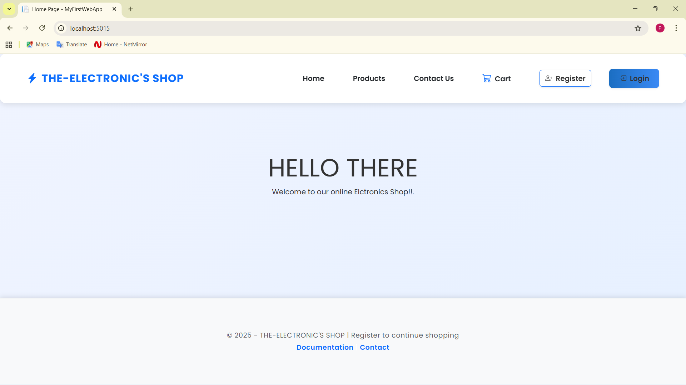
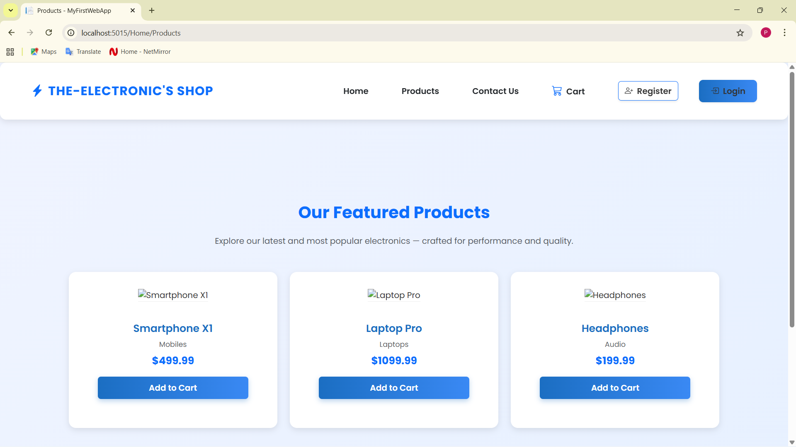
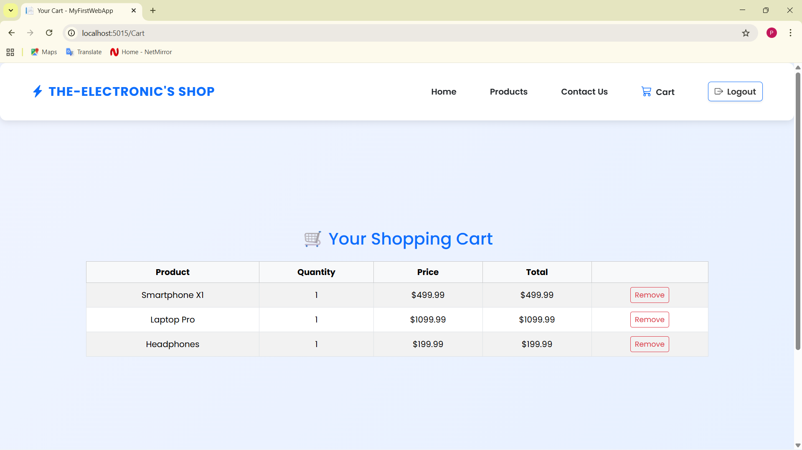
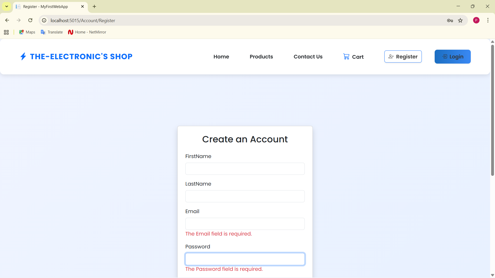

# 🛍️ MyFirstWebApp

A **.NET MVC e-commerce web application** featuring user authentication, shopping cart functionality, and an admin dashboard to manage products and users.

---

## 🚀 Features

- User registration & login system  
- Add to Cart / Remove from Cart  
- Product listing with images  
- Admin panel for managing users and products  
- SQL Server database integration  
- Responsive Bootstrap UI  

---

## 🧩 Tech Stack

- **Frontend:** HTML, CSS, Bootstrap  
- **Backend:** ASP.NET Core MVC (C#)  
- **Database:** Microsoft SQL Server  
- **IDE:** Visual Studio Code  

---

## ⚙️ Installation Steps

1. **Clone the repository:**
   ```bash
   git clone https://github.com/prem-suthar/MyFirstWebApp.git
   cd MyFirstWebApp
## 🖼️ Screenshots

### 🏠 Home Page


### 💻 Products Page


### 🛒 Cart Page


### 🔐 Register Page

